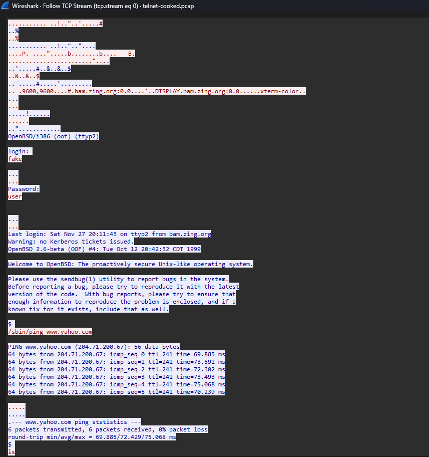
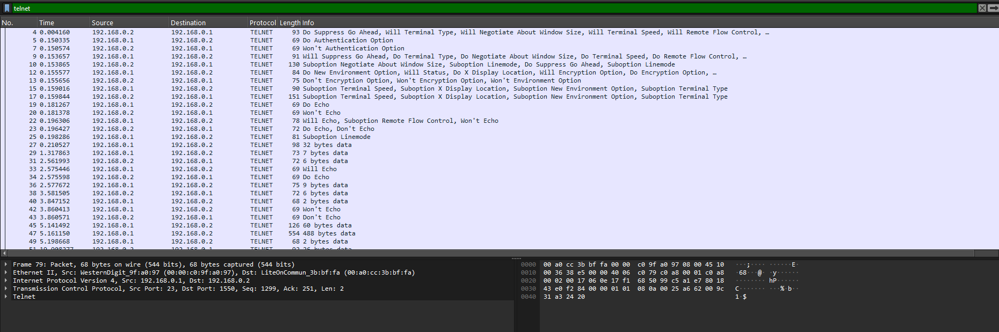
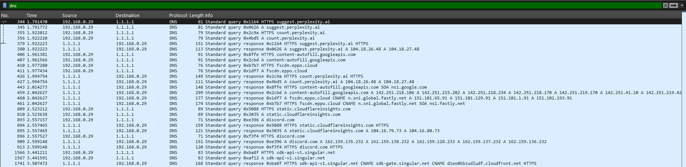
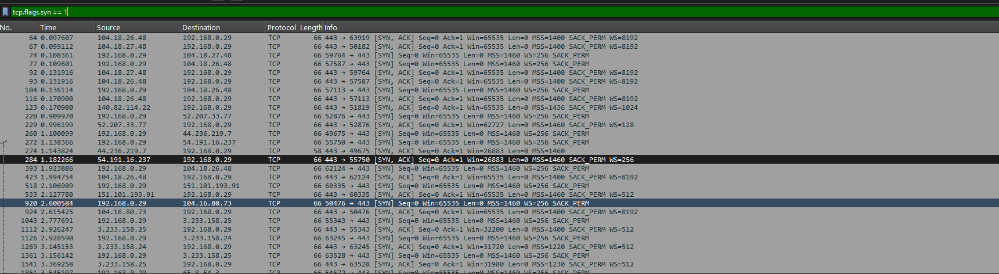
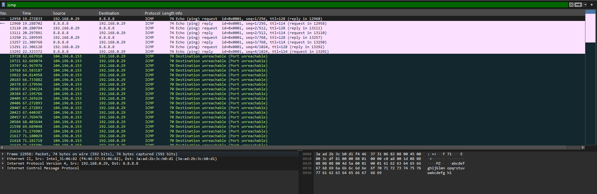

# Network Traffic Analysis — Findings

**Analyst:** Vishwa Prakash Choudhary
**Date:** May 2026
**Tools:** Wireshark 4.6.4, Python 3 (Scapy)
**Captures:**
- `telnet-cooked.pcap` — sample Telnet session (Wireshark wiki)
- `my_capture.pcap` — 23,991 packets from my home network

---

## What I was looking for

Credentials in plaintext. Unencrypted web traffic. DNS queries leaking browsing history. Basically anything that someone sitting on the same Wi-Fi could see without doing anything clever.

I used two captures: a Telnet sample (to show what credential theft looks like at the packet level) and a live capture from my own network (to see how a real Windows 11 setup holds up in 2026).

---

## Finding 1: Telnet login credentials recovered from capture (Critical)

**Capture:** telnet-cooked.pcap
**MITRE ATT&CK:** T1040 (Network Sniffing), T1078 (Valid Accounts)
**Relevant controls:** PCI DSS v4.0 Req 4.2.1, NIST SP 800-53 SC-8

92 packets, all Telnet, between 192.168.0.2 and 192.168.0.1. The entire session is unencrypted.

I opened Follow > TCP Stream in Wireshark and the login was right there in readable text:



The username is `fake` and the password is `user`, both fully visible in the TCP stream without any decryption. This is a public sample capture, so the credentials aren't sensitive, but the technique is identical to what works on real Telnet sessions. The protocol doesn't distinguish between a lab and production.

After login the server revealed it's running OpenBSD 2.6-beta on `bam.zing.org`. The user ran:

```
/sbin/ping www.yahoo.com
/sbin/ping www.yahoo.com
ls
ls -a
exit
```

The `ls -a` output showed dotfiles: `.cshrc`, `.login`, `.mailrc`, `.profile`, `.rhosts`. So an attacker now has credentials, OS version, hostname, and filesystem layout. That's enough for lateral movement.



My Python script also recovered the keystrokes automatically by stripping IAC negotiation bytes and reassembling the client-to-server payloads.

**Fix:** SSH. Telnet should not be running anywhere. Block port 23 at the firewall and alert on it with IDS rules.

---

## Finding 2: DNS queries expose browsing patterns (Medium)

**Capture:** my_capture.pcap (live)
**MITRE ATT&CK:** T1040 (Network Sniffing)
**Relevant controls:** NIST SP 800-53 SC-8

Every DNS query from my machine goes out as plaintext UDP to Cloudflare (1.1.1.1). I found 26 unique domains, and some of them are pretty revealing:

| Domain | What it tells you |
|--------|-------------------|
| discord.com | I use Discord |
| suggest.perplexity.ai | I was using Perplexity AI |
| accounts.google.com | Google account activity |
| www.y8.com | I was on a gaming site |
| fun-cc.azurewebsites.net | Some Azure-hosted app |
| login.microsoftonline.com | Microsoft login attempt |



Someone at a coffee shop running Wireshark on the same network could build a profile of what I'm doing online just from DNS. They wouldn't see the content (that's encrypted), but the domains alone tell a story.

There's also local network noise, my Westinghouse Roku TV is broadcasting mDNS packets advertising itself on the LAN. Not a vulnerability exactly, but it tells an observer what devices are on my network.

**Fix:** DNS-over-HTTPS. Chrome has it built in (Settings > Privacy > Use Secure DNS). Windows 11 supports it at the OS level for Cloudflare. I probably should have turned this on already.

---

## Finding 3: All web traffic is HTTPS (good news)

**Capture:** my_capture.pcap (live)

I filtered for SYN packets to see where my machine was initiating connections. 143 SYN packets, every single one going to port 443.



Zero HTTP. No port 80 traffic at all. The browser layer is doing its job and everything is encrypted in transit. The weak spot is DNS (Finding 2), not the web traffic itself.

---

## Finding 4: ICMP behavior and port unreachable responses

**Capture:** my_capture.pcap (live)

I ran `ping 8.8.8.8` during the capture. The Echo request/reply pairs are visible and working normally, 5 pings sent, 5 replies received.

But there's something else: a bunch of ICMP "Destination unreachable (Port unreachable)" messages from 104.196.0.153. Something on my machine tried to reach a UDP port on that IP and got rejected repeatedly over about 10 seconds.



This could be a background service trying to reach a server that's no longer listening, or a UDP-based protocol timing out. Not a security vulnerability on its own, but in a SOC environment this pattern would be worth investigating — repeated port-unreachable messages can indicate scanning, misconfiguration, or a service that moved.

---

## Script output

Here's what the automated analysis looks like on the Telnet capture:

```
============================================================
  PCAP ANALYSIS REPORT
  File: telnet-cooked.pcap
  Date: 2026-04-03 20:16
  Packets: 92
============================================================

--- Protocol breakdown ---
  Telnet            92  (100.0%)

--- Top source IPs ---
  192.168.0.2            48 packets
  192.168.0.1            44 packets

--- TELNET KEYSTROKES (plaintext!) ---
  Session: 192.168.0.2->192.168.0.1
  Recovered input:
    > fake
    > user
    > /sbin/ping www.yahoo.com
    > /sbin/ping www.yahoo.com
    > ls
    > ls -a
    > exit

============================================================
  FINDINGS (1 issue)
============================================================

  [!!] CRITICAL - #1: Telnet session with plaintext keystrokes
      Protocol: Telnet
      MITRE ATT&CK: T1040 (Network Sniffing), T1078 (Valid Accounts)
      Recovered 7 lines of user input from 192.168.0.2 to 192.168.0.1

  Total: 1 critical, 0 high, 0 medium
============================================================
```

---

## Recommendations

| What to do | Why | Finding |
|------------|-----|---------|
| Kill Telnet, use SSH | Credentials and commands are fully exposed | 1 |
| Block port 23 at firewall | Prevent Telnet even if it's installed somewhere | 1 |
| IDS rule for Telnet traffic | Alert if it shows up on the network | 1 |
| Enable DNS-over-HTTPS | Stop leaking which domains you visit | 2 |
| Investigate repeated ICMP port-unreachable | Could be misconfigured service or scanning | 4 |
| Audit devices broadcasting on LAN | Roku TV advertising via mDNS is noisy | 2 |

---

*Vishwa Prakash Choudhary, UC Davis, Computer Science*
